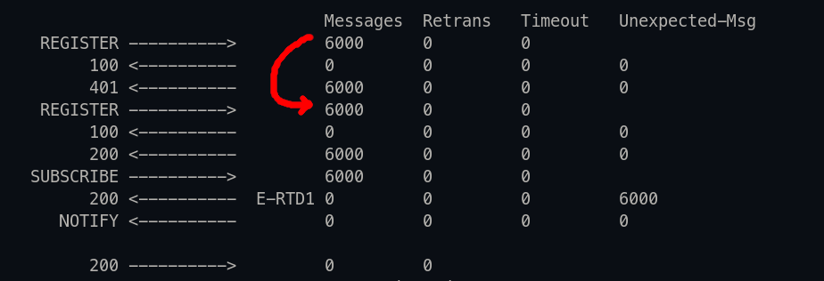
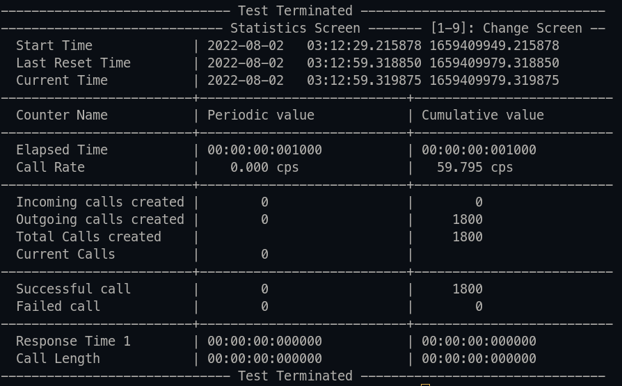

# VoIP Application
---
### INTRODUCTION 
A VoIP application, that controls and manages Asterisk (PBX). 

### GOALS
Handle 6000 registered extensions
Handle 1800 concurrent calls
High Availability

### TOOLS USED
**[Laravel](https://laravel.com/)** - is a web application framework with expressive, elegant syntax
**[Mysql](https://www.mysql.com/)** - is an open-source relational database management system
**[Asterisk](https://www.asterisk.org/)** - an open-source framework for building communications applications
**[Alembic](https://alembic.sqlalchemy.org/)** - is a lightweight database migration tool for usage with the SQLAlchemy Database
**[SIPp](http://sipp.sourceforge.net/)** - is a free Open Source test tool / traffic generator for the SIP protocol
**[Docker](https://www.docker.com/)** - is a set of platform as a service products that use OS-level virtualization to deliver software in packages called containers

### RQUIREMENTS
* Docker 20.10 or higher
* docker-compose 2.7 or higher
* Firewall Configuration

**Open required ports**
You must open these ports on the docker server host. Because Asterisk service in docker-compose.yml uses Host network and docker can't open a large number of ports in bridge mode yet.
```bash
sudo ufw allow 5060,5061/tcp
sudo ufw allow 5060,5061/udp
sudo ufw allow 10000:20000/udp
```

### INSTALLATION FROM SOURCE
Clone Repository and move to laravel directory
```bash
git clone https://github.com/thinker-amir/VoIP
cd VoIP/laravel
```
Install Compose Dependencies
```bash
./install_composer_dependencies
```
Create .env File
```bash
cp .env.example .env
```
Config your .env File (example)
```bash
vi .env
```
Set Some Import Variables
> HOST_ADDRESS=  # Set your host ip or domain
> ...
> DB_HOST=mysql           
> DB_PORT=3306            
> DB_DATABASE=asterisk    
> DB_USERNAME=asterisk    
> DB_PASSWORD=asterisk    
> FORWARD_DB_PORT=33060   

`Warning:` It dose not prepare for production environment. Use it only on testing environment.

### RUN THE APPLICATION
```bash
./vendor/bin/sail up -d
```
Insert Defaults to Database
create `6000` endpoints (extensions) and sipp extensions for test concurrent calls
```bash
./vendor/bin/sail exec laravel php artisan db:seed
```

### RUN Stress Testing with SIPp
`Options explanations`
| Syntax | Description |
| ----------- | ----------- |
| -s | Exten |
| -d | Controls the length of calls in msec |
| -l | Limit simultaneous calls | 
| -m | Stop and exit after specified tests count | 
| -r | Scenario execution rate | 
See [SIPp cheatsheet](https://tomeko.net/other/sipp/sipp_cheatsheet.php?lang=en) for more information.
#### REGISTER `6000` EXTENSIONS
```bash
sail exec sipp  sipp <HOST_ADDRESS> -sf REGISTER_SUBSCRIBE_client.xml -inf REGISTER_SUBSCRIBE_client.csv -m 6000 -l 200 -r 200 -d 10000
```
Change <HOST_ADDRESS> to your docker host address

You should see the result like following picture

#### CREATE `1800` CONCURRENT CALLS
```bash
sail exec sipp sipp -s 1 <HOST_ADDRESS> -d 20000 -l 1800 -m 1800 -r 200
```
Change <HOST_ADDRESS> to your docker host address

You should see the result like following picture


### Reference Asterisk Performance Tuning
Tune performance according to Asterisk's article guide
See [this link](https://wiki.asterisk.org/wiki/display/AST/Performance+Tuning) for more information.